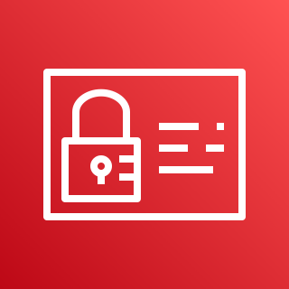

# IAM
## 概要

AWSにおける権限管理サービス。アカウントを安全に運用するために利用。

| 重要単語 | 意味 | 
|:-----------|:------------|
| ルートアカウント| すべての権限を持ったアカウント  アカウント登録時の初期アカウント  |
|ユーザー|ルートアカウント内に生成できるユーザー   一つのアカウントで複数のユーザーを管理できる|
|ユーザーグループ|同じ権限を付与するためのグループ  ユーザーのみを含む|
|ロール|AWSのサービス(EC2やLamdbaがよく使われる)から、 他のサービスへのアクセス権限を定めたもの|
|ポリシー|権限についての記述   JSON形式で記述される |

## 機能
### ポリシー設計
権限をJSON形式で記述したもの。ユーザー、ユーザーグループ、ロールにそれぞれ割り当てることができ、それらが割りつけられた対象はポリシーに従って権限が付与される。

#### 第一階層 (Consist of)
| key | 記述内容 | 
|:-----|:------|
| Version | ポリシーのバージョン |
| Id | 特定のポリシー (任意) |
| Statement | 1つ以上のステートメント (必須) |

#### Statement内の第二階層  (Statement consist of)

| key | 記述内容 | 
|:-----|:------|
| Sid | satatement内のID番号 |
| Effect | 許可するか拒否するか |
| Principal | このポリシーを割り当てるアカウント、ユーザー、ロール |
| Action | 許可(拒否)するアクションのリスト |
| Resorce | アクションをを適用するリソース|
| Condition | このポリシー自体の状態。(任意) |
 

### ユーザー・ユーザーグループ
- ユーザー自体にインラインポリシーを付与することができる
- ユーザーグループにポリシーを付与し、それをユーザーに割り当てることができる
- ユーザーは複数のユーザーグループに属すことができる(属さなくてもよい)

### ロール
- AWSのサービスに対して付与
- そのサービスからAWSの他のサービスに対しての権限
- EC2、Lamdbaによく使う

### パスワード設定
- ユーザー対してパスワードの制約条件を設定できる

### 多段階認証 (Malti Factor Authentication)
- 多段階認証を導入することによりセキュリティ向上
- 特にルートアカウントの設定をおすすめ
- 2種類の方法
  - Virtual MFA device
    - スマホアプリケーションと連携。ワンタイムパスコード。
  
  - Universal 2nd Factor (U2F) Security Key
    - 専用デバイス。挿入するのみでMFA完了のものや、ワンタイムを表示するためのデバイスがある。
     
### AWSへのアクセス方法
3つの方法

| key | 記述内容 | 
|:-----|:------|
| AWSマネジメントコンソール | メールアドレス + パスワード|
| AWS Command Line Interface(CLI) | アクセスキー (Access Key ID + Secret Access Key)|
| AWS Software Developer Kit (SDK) | アクセスキー |

アクセスキーはユーザーごとに設定可能。
漏らさないように！！]

### IAMセキュリティーツール

| ツール | 概要 | 
|:-----|:------|
| IAM Credential Report | アカウント内のユーザーとそれぞれの権限情報を確認できるレポート |
| IAM Access Advisor | ユーザーがなんの権限を持っていて、それぞれのサービスに最後いつアクセスしたのか確認できるレポート |

### IAM ベストプラクティス
- アカウントセットアップ以外ではルートアカウントを使用しない
- 1人に対して1ユーザーを割り当てる
- ユーザーにはユーザーグループで権限を与える
- 強力なパスワードポリシーを設定すること
- MFAを使用すること
- AWSのサービスにはロールを付与すること
- CLIやSDKにはアクセスキーを使用すること
- ユーザーの権限情報はIAM Credential ReportやIAM Access Advisorで監査すること
- 絶対にIAM ユーザーとアクセスキーをシェアしないこと
- 
## その他留意事項